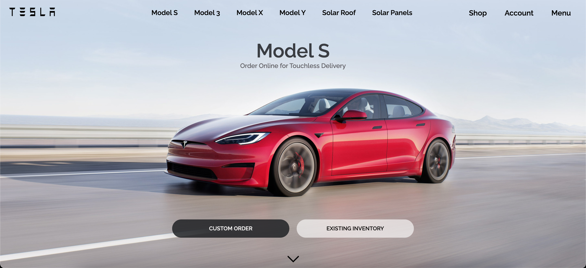
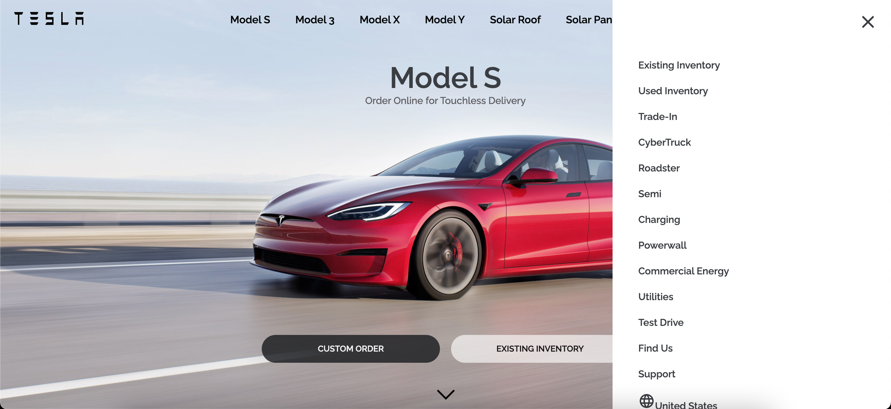

<h1>React Tesla Clone :car: </h1>

  

This is a front-end application that mimics Tesla's landing page. It was built with React + Redux. The website is fully responsive.

## 2 Screenshots

UI-wise this application looks like the original Tesla Landing Page with the exception of the scroll feature
>Landing page

>Right menu opened

## 3 Technologies & Components Used :toolbox:

    - ReactJS
    
    - CSS 

    -  React Reveal Module for scrolling animations (Fade effect)
 
    - Styled Components 
        - Used this for most of the css components

    - Material Ui for icons
        

## 4 Website structure :construction_worker:

 - **Application**
    - Header
        - logo
        - menu (left menu)
        - right menu
    - **Components**
        - Section: The first section that includes the bouncing down arrow
        - Sections: car models through assessories 
        - *All of the Sections included:*
            - text components (for headings and paragraphs)
            - button component 
    - **Footer** 

